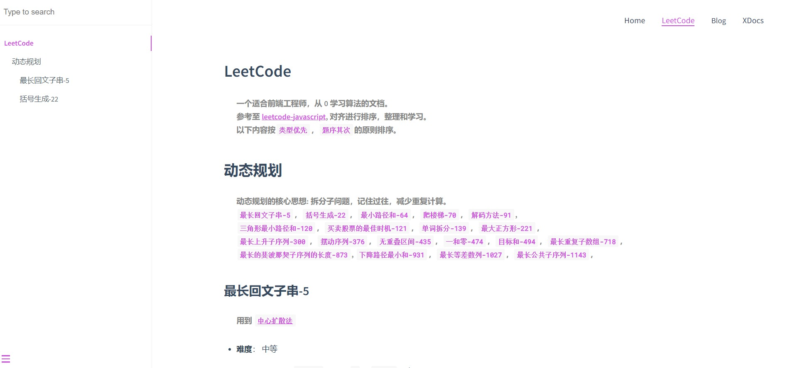

# 博客介绍
> 主要用于前端工程师，算法初学者，想使用javascript 练习LeetCode算法的我们。  
> 记录刷题的过程，提升算法能力，争取早日进大厂。  

## 线上部署
> 进度: 部署中...

## 效果预览

### 主页


### 文档页



## 配置
> 参考[docsify](https://docsify.js.org/)

## 安装cli
```sh
cnpm i y18n ansi-colors docsify-cli -g
# 全局安装依赖
```

## 启动项目
```sh
docsify serve ./docs
# 如果启动后提示缺少依赖，根据提示全局安装对应的依赖
# 如上面的 y18n  ansi-colors 就是博主启动时，提示的依赖
```

## 编辑项目
> 所有的项目都以`.md`文件的形式存在，  
> 具体配置导航，封面，主题等等，请查看[docsify](https://docsify.js.org/)

## 写在最后
> 如果你和我一样，想要记录自己`成长的脚步`，方便日后`复习`，不妨常来看看该项目。  
> 如果有时间，推荐从零搭建一个`属于自己的`文档博客。  
> 如果对您有帮助，点个 `star` 将是对我最大的鼓励 ~